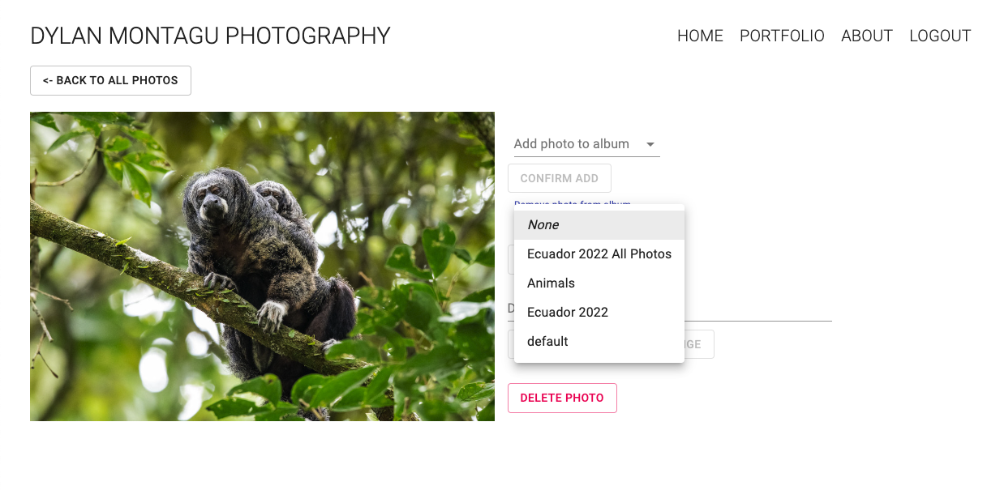

# Dylan Montagu Photography | dylanmontagu.com

## Intro
I've wanted to gain improve my front-end skills and improve my understanding of JavaScript/React for a while. Coupled with my mother's demands that I share my photographs with her, creating this website to share my photography work was the perfect project.

This application is built on a MERN stack (MongoDB, Express, React, Node). Photos are hosted on AWS S3 and accessed via AWS Cloudfront. The whole application is currenlty deployed, hosted, and maintined via AWS Elastic Beanstalk. 

## The back-end

#### Database
The persistance layer for this application is a MongoDB instance hosted with MongoDB Atlas. The benefits of this set up are: 
- MongoDB Atlas provides a cloud hosted and managed DB service that is easy to set up and link and connect to. This streamlined my development and was much more preferable to hosting my own MongoDB instnace in AWS.
- MongoDB Atlas has a free tier service - woohoo!
- During development, a schemaless design made it very easy to quickly implement changes as I explored the extent of funcitonality I wanted my applicaiton to support.

#### Image Storage
My initial design was to host images on S3 in private buckets, with images to be served to the client via pre-signed URLS. The benefits for this was privacy through only authorized users have access to transient URLs - a layer in protection from image theft. Initial implementations of this design worked great, however as my vision for the project changed from a webpage to share photos with only family to a site to share my photography with a wider audience, this design became unecessary. Ultimately, I settled on hosting images on S3 with CloudFront, allowing storage and caching closer to end users around the world (my primary audience outside of the U.S. being my grandparents in Vietnam). 

Besides image hosting, proper implementation of serverside resizing was another design aspect that I played around with extensively. Initial attemtpts of only uploading and displaying a single sized image weren't meeting my requirements - uploading large sized images woudl cause image albums to load too slowly, while lower quality photos didn't look nearly good enough on a full screen. After much playing around, I ended up with four resized image configuratinos that worked well with my lightroom-exported photo specs. Having a variety of images sizes to work with (thumbnail, small, medium, and fullsize) allowed to optimze image quality against user experience and image loading times, allowing image albums to load quickly while also providng a better quality image when viewing individual photos. 

## Admin 

#### User Authentification

Authentification is enforced with a JWT based design. Three roles are currently supported by the application: Admin, AdminDemo, and Visitor (no defined role). 
- Admins have full access to the site, including view of the admin dashboard, abilty to upload and delete photos, re-ordering photos with albums, etc. 
- AdminDemo users have access to views to everything Admin users, however in a read/view only capacity. Attempts to modify image orders or rename an album will result will fail for the user. This role was create to share the full extent of the website with third parities, without any of the permiessions to actually change the website. Admin demo credentials for anyone to use are:
    - url: https://dylanmontagu.com/login
    - username: admin.demo@gmail.com
    - password: admindemo123456
- Visitors are unable to access any of admin views or services, and un-authenticated attempts to access admin endpoints will fail. 

## The front-end

#### Front-end Framework/Library
As this project was also an opportunity for me to learn current frameworks, I ultimately chose to make a react React client due to its popularity and prevalence. 

#### Image Display
For image tiling, I chose to work with the react-photo-gallery. This package provided dynamic responsive photo tiling implementation, and worked for the majority of image ratios I wanted to display (I still have issues with properly integrating panoramas into my photo albums - a nature of the algorithm used for the dynamic tiling). 

For singulary image dispaly - such as when a user clicks on an image - I wanted to use a 'lightboxes' that dimmed the page and showed a larger version of a clicked on image. I was unable to find lightbox a library that worked as well as I wanted, so my current solution is to have a user brought to a seperate endpoint when clicking on an image. This is temporarly fix while I work in devleoping a custom lightbox solution. 

## Admin Console

The main 'CRUD' operations that need to be supported to provide adequate functionality for an admin to manage the site are relatively straight forward and revolve around adding photos to the the website, creating albums, adding and reordering and removing photos from albums, and deleting photos. 

This funcitonality was straight forward to add on the back-end. On the front end, my main requirements were to implement a click and drag UI for reordering photos - everything besides that was just a thin UI layer on top of my API for adding, reordering, and removing photos. 

#### Edit all photos

Clicking on "EDIT ALL PHOTOS" from the Admin Console will bring a user to a page showing all photos uploaded to the site. Photos are low resolution (thumbnail sized), however pagination still needs to be implemetned to improve render times that suffer when accessing this page with low bandwidth. From this page, the user can click on any photo and add or remote the photo from an album, add an image description, or delete the image from the website and consequently remove the image from any albums it may be in. 

#### Editing an album

Albums under "EDIT AND REORDER ALBUMS IN LIBRARY" can be reordered via click and drag. Clicking on an album from this section will brin the user to a page where photos in the album can be re-arranged, and the album can be re-named, deleted, or removed from the main library of albums (the album is no longer displayed on the main website, however the album is saved and viewable in teh admin console. It can be re-added to the main 'library' whenever). 

Clicking on an image when within the page of editing an album will show a small pop up allowign the user to add a photo as the album thumbnail, remove the photo from teh album, or be linked to a page to edit that specific photo as shown above under "EDIT ALL PHOTOS". 

Full functionality of the Admin Console can be viewed on a demo, read-only basis by logging in to applicaiotn wiht the following credentials: 
- url: https://dylanmontagu.com/login
- username: admin.demo@gmail.com
- password: admindemo123456

#### Design Process
With the primary focus of this applicaition being around sharing photographs, frontend development was done with the intention of a minimalistic interface that focused on the images. White background with black lettering provided a neutral, clean look that neither detracted nor added too much 'noise' to the presentation of the images. 

Implementing slight image zoom and highlighting on hover provided a subtle way of shwoing what image a user was about to select. This effect in addition to album name darkeing during album navigation provided the minimalistic effect I was looking for. 

Componenet/text resizing was somethign I wanted to have a base implementation of in order to provide a good UI whether the website was accessed from mobile or viewed full screen on a monitor. While the current implementation addresses most componenets such as the navigation bar, there still remain some componenets that need to be addressed such as album name displaoys on small screens. 

## Deployment/Hosting
For production deployment, the server is configured to serve a static build file of the frontend. Initial issues with routes not working on the cliet side were identified as stemming from react-router doing all routing on the browser side rather than an application-based structure with routes served by the server. The issue resolved by serving the static build file with every request from the client. This currenlty is a band-aid fix, and I am looking into a less costly solution. 

The applicaiton was deployed with AWS Elastic Beanstalk, which when combied with the elastic beanstalk CLI allows me to manage the applicaiton from my personal machine via CLI. 

Current hosting is configured to host on a single free tier t2 micro instnace fronted by an AWS applicaiton load balancer. The load balancer is currently only being used for HTTP to HTTPS redirect. Due to my low traffic and lack of need of multiple instnaces fronted by a load balancer, I will plan to remove the load balancer once I am able to configure the apache server hosting my applicaiotn to carry out HTTP -> HTTPS redirect. 

## Things to Improve/TODO

- Since the majority of the traffic is read-only resulting from viewing pictures on the website, moving all non-read operations to a serverless solutions such as AWS Lambdas and serving the frontend build file directly from S3 would allow me to no longer have to pay to maintain a EC2 instance all the time, and instead spin up lambdas as necessery adding/deleting/rearranging photos and albums. 
- My initial design for image storage was implemented using S3 and pre-signed URLs. Although I moved away from this design for the current site, I believe there is a useful use case for delivering image files via pre-signed URLs. If I wanted to create albums that were truly secure in order to share personal photos with friends and family, rather than just sharing a link to an album that isn't in the main ablum library and therefore not viewable from the main website ('secure' by obscurity since URLs to albums are specified by random uuid), I could have a subset of images only accessible with credentials. In this design, sharing a link to an album woudln't be enough to view the images - it would also require a user to be logged in and authorized. Additionally, image specific URLs woudl be transient, and coudl be configured to only be vieweable in a specific session, removing the worry of sharing image URLs. 
- Some bugs remain when trying to view the image from mobile.
- Implement a lightbox view panel for when a image is clicked by a user.
- When a user has clicked on an image and is viewing a webapge displaying a single image, when a user navigates to the previous album view, the view will return to the top of the screen. Attempts to implement a solution where a user would be returned to where their previous view was (for exmaple, halfway down the page having scrolled through half of the photos) didn't work due to poor interactions between packages implementing this funcitonaltiy, and the implementation of react-photo-gallery, the photo tiling library. This is high priority fix to address, and could ultimatley be resolved by implementing a lightbox solution. 
